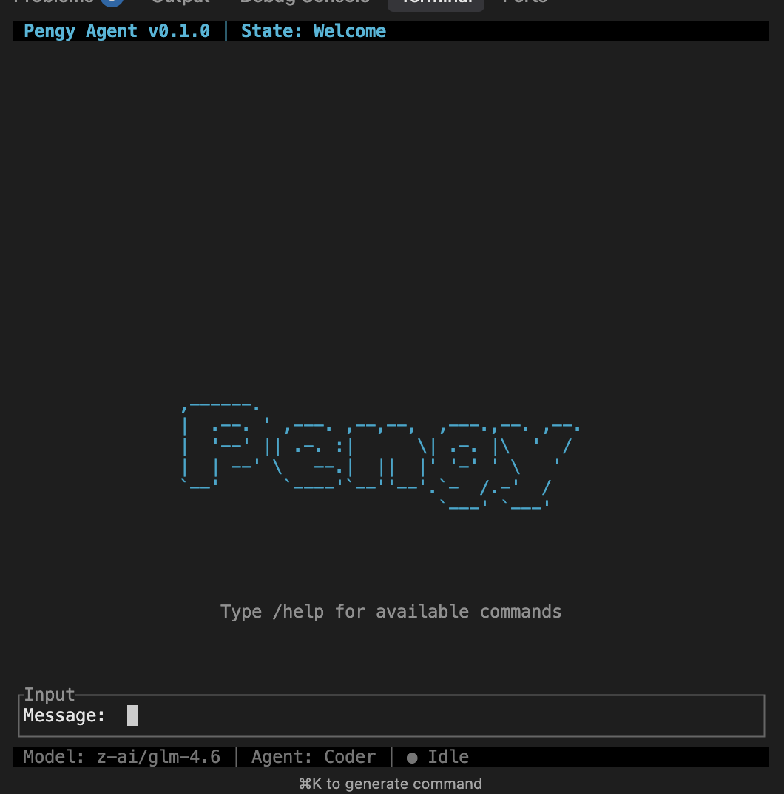

# Pengy Agent CLI

A terminal-based chat interface for interacting with AI agents and LLMs written in Rust. 




## Why PengyAgent

This repository is intended for both industrial and academic use. Therefore, our plan has two main purposes.

First, for industrial settings, we do not focus on just one coding agent. Since there are many teams such as Cursor, OpenCode, Codex, and Trae, our focus is to automate partial tasks. This means we split the work into multiple small agents, each focusing on certain subtasks and specific tools. This approach allows users to handle different tasks without relying solely on a general-purpose agent.

Second, for academic settings, this repository aims to provide a training setup for agents. This means large language models (LLMs) can use this environment to learn how to use specific tools. Our ultimate goal is to address the following problems:

1. Every time new tools are designed, others cannot easily reuse them.
2. It is difficult to distill knowledge from a teacher LLM model to a student model within an agent setup.


## Building

Build the CLI binary:

```bash
cargo build --release
```

The binary will be available at `target/release/pengy`.

## Installation

To install the CLI system-wide so you can run `pengy` from anywhere:

### Option 1: Install to user local bin (recommended)

```bash
cargo build --release
cp target/release/pengy ~/.local/bin/
```

Make sure `~/.local/bin` is in your PATH. Add this to your `~/.zshrc` or `~/.bashrc` if needed:

```bash
export PATH="$HOME/.local/bin:$PATH"
```

### Option 2: Install using Cargo (if ~/.cargo/bin is in PATH)

```bash
cargo install --path . --bin pengy
```

After installation, verify it works:

```bash
pengy
```

## Running

Run the CLI from anywhere after installation:

```bash
pengy
```

Or run directly from the project directory without installation:

```bash
cargo run --bin pengy
```

## Configuration

On first run, configure your API key and select a model:

1. Press `/settings` to set your API key (OpenRouter API key)
2. Press `/models` to select a model
3. Press `/agents` to choose an agent type (Coder, Code Researcher, Test Agent, Control Agent, Issue Agent, or Pengy Agent)

Configuration is saved to `.pengy_config.json` in the current directory. You can also set the `API_KEY` environment variable.

## Usage

- Type messages to chat with the selected agent
- Press `/models` to switch models
- Press `/agents` to switch agent types
- Press `/settings` to update API key
- Press `/help` for available commands
- Press `Esc` to exit

## Requirements

- Rust (latest stable version)
- API key from OpenRouter or compatible API provider
